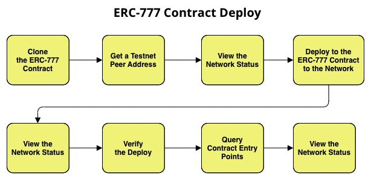

# `ERC777 TUTORIAL`

This tutorial introduces an implementation of the ERC-777 standard from ERC-20 standard for the Casper blockchain. The code for ERC-777 tutorial is available in [GitHub](https://github.com/Rengo-Labs/CasperLabs-ERC777).

The [Ethereum Request for Comment (ERC-20)](https://eips.ethereum.org/EIPS/eip-20#specification) and the [Ethereum Request for Comment (ERC-777)](https://eips.ethereum.org/EIPS/eip-777#specification) standard are integral parts of the Ethereum ecosystem. This standard is well established for building new tokens based on smart contracts. These ERC-777 tokens are blockchain-based assets that have value and can be transferred or recorded.

The ERC-777 standard defines a set of rules that dictate the total supply of tokens, how the tokens are transferred, how transactions are approved, and how token data is accessed.

What's more, ERC-20 functions are added to support the previous implementation which is defined as : `total_supply`, `transfer`, `transfer_from`, `approve`, `balance_of`, and `allowance`. As part of this tutorial, we will review the [contract](https://github.com/casper-ecosystem/erc20/blob/master/example/erc20-token/src/main.rs) and the [casper_erc20](https://docs.rs/casper-erc20/latest/casper_erc20/) library.

The ERC-777 functions are: `granularity`, `send`, `burn`, `operator_send`, `operator_burn`, `default_operators`, `authorize_operator`, `revoke_operator`, 

If you haven't read [Writing Rust Contracts on Casper](https://casper.network/docs/dapp-dev-guide/writing-contracts/rust/), we recommend you start there.

On the other hand, you can use [ERC777-client](https://github.com/Rengo-Labs/CasperLabs-ERC777-client) to deploy and perform operations with this contract.

# Preparation

First clone the contract from GitHub:

```bash
git clone https://github.com/Rengo-Labs/CasperLabs-ERC777.git && cd CasperLabs-ERC777
```

Prepare your environment with the following command:

```bash
make prepare
```

If your environment is setup correctly, you will see this output:

```bash
rustup target add wasm32-unknown-unknown
info: component 'rust-std' for target 'wasm32-unknown-unknown' is up to date
```

If you do not see this message, check the [Getting Started Guide](https://casper.network/docs/dapp-dev-guide/getting-started/).

Next, compile your contract and run the contract unit tests.

```bash
make build-contract
make test
```

# Contract Implementation

In [GitHub](https://github.com/Rengo-Labs/CasperLabs-ERC777), you will find a library and an [example implementation](example/implementations/erc777-token/src/main.rs) of the ERC-777 token for the Casper Network. This section explains the example contract in more detail.

**Note**: To successfully execute the contract you need to copy the full contract file with all the necessary imports, declarations, and functions. All those parts are required to compile it. To execute the contract you need to deploy the .wasm file on the network.


## Installing Required Crates {#installing-crates}

Since this is a Rust implementation of the ERC-777 token for Casper, we will go over a few implementation details. Casper contracts require the following crates to be included:

- [casper_contract](https://docs.rs/casper-contract/1.3.3/casper_contract/) - A Rust library for writing smart contracts on the Casper Network
- [casper_types](https://docs.rs/casper-types/latest/casper_types/) - Types used to allow creation of Wasm contracts and tests for use on the Casper Network
- [casper_erc777](https://docs.rs/casper-erc20/latest/casper_erc20/) - A library for developing ERC-777 tokens for the Casper Network

Here is the code snippet which imports those crates:

```rust
use casper_contract::{contract_api::runtime, unwrap_or_revert::UnwrapOrRevert};
use casper_types::{CLValue, U256, bytesrepr::Bytes};
use casper_erc777::{
    constants::{
        ADDRESS_RUNTIME_ARG_NAME, AMOUNT_RUNTIME_ARG_NAME,
        NAME_RUNTIME_ARG_NAME, OWNER_RUNTIME_ARG_NAME, RECIPIENT_RUNTIME_ARG_NAME,
        SPENDER_RUNTIME_ARG_NAME, SYMBOL_RUNTIME_ARG_NAME, TOTAL_SUPPLY_RUNTIME_ARG_NAME,
        DATA_RUNTIME_ARG_NAME, GRANULARITY_RUNTIME_ARG_NAME, OPERATOR_DATA_RUNTIME_ARG_NAME,
        OPERATOR_RUNTIME_ARG_NAME, SENDER_RUNTIME_ARG_NAME, TOKEN_HOLDER_RUNTIME_ARG_NAME,
        ACCOUNT_RUNTIME_ARG_NAME, HASH_ERC1820_RUNTIME_ARG_NAME
    },
    Address, ERC777,
};
```

**Note**: In Rust, the keyword `use` is like an include statement in C/C++.


## Initializing the Contract {#initializing-the-contract}
Initializing the contract happens through the `call()` function inside the [contract file](example/implementations/erc777-token/src/main.rs). When you deploy the contract, you need to initialize it with a `call()` function and define `name`, `symbol`, `decimals`, `total_supply`, and `erc1820_hash`.

The code snippet for initializing the contract should look like this:

```rust
#[no_mangle]
fn call() {
    let name: String = runtime::get_named_arg(NAME_RUNTIME_ARG_NAME);
    let symbol: String = runtime::get_named_arg(SYMBOL_RUNTIME_ARG_NAME);
    let granularity = runtime::get_named_arg(GRANULARITY_RUNTIME_ARG_NAME);
    let total_supply = runtime::get_named_arg(TOTAL_SUPPLY_RUNTIME_ARG_NAME);

    //Delete this field and replace for a ContractHash::default()
    let erc1820_hash = runtime::get_named_arg(HASH_ERC1820_RUNTIME_ARG_NAME);

    let _token = ERC777::install(
        name,
        symbol,
        granularity,
        total_supply,
        erc1820_hash
    ).unwrap_or_revert();
}
```

## Contract Methods {#contract-methods}

This section briefly explains the contract methods used in our ERC-20 contract.

To see the full implementation of the below contract methods, refer to the [contract file](example/implementations/erc777-token/src/main.rs) in Github. If you have any questions, review the [casper_erc20](https://docs.rs/casper-erc20/latest/casper_erc20/) library and the [EIP-777](https://github.com/ethereum/EIPs/blob/master/EIPS/eip-777.md) standard.

Also, for further unresolved issues please contact the casper development team via the Discord channel.

Contract methods for ERC-20 are:

-   [**allowance**](https://github.com/casper-ecosystem/erc20/blob/70003da1bc2aa544bb3687ba79bb5fd4bd5b5525/example/erc20-token/src/main.rs#L71-L77) - Returns the amount of owner’s tokens allowed to be spent by the spender
-   [**approve**](https://github.com/casper-ecosystem/erc20/blob/70003da1bc2aa544bb3687ba79bb5fd4bd5b5525/example/erc20-token/src/main.rs#L63-L69) - Allows a spender to transfer up to an amount of the direct caller’s tokens
-   [**balance_of**](https://github.com/casper-ecosystem/erc20/blob/70003da1bc2aa544bb3687ba79bb5fd4bd5b5525/example/erc20-token/src/main.rs#L46-L51) - Returns the token balance of the owner
-   [**decimals**](https://github.com/casper-ecosystem/erc20/blob/70003da1bc2aa544bb3687ba79bb5fd4bd5b5525/example/erc20-token/src/main.rs#L34-L38) - Returns the decimals of the token
-   [**name**](https://github.com/casper-ecosystem/erc20/blob/70003da1bc2aa544bb3687ba79bb5fd4bd5b5525/example/erc20-token/src/main.rs#L22-L26) - Returns the name of the token
-   [**symbol**](https://github.com/casper-ecosystem/erc20/blob/70003da1bc2aa544bb3687ba79bb5fd4bd5b5525/example/erc20-token/src/main.rs#L28-L32) - Returns the symbol of the token
-   [**total_supply**](https://github.com/casper-ecosystem/erc20/blob/70003da1bc2aa544bb3687ba79bb5fd4bd5b5525/example/erc20-token/src/main.rs#L40-L44) - Returns the total supply of the token
-   [**transfer**](https://github.com/casper-ecosystem/erc20/blob/70003da1bc2aa544bb3687ba79bb5fd4bd5b5525/example/erc20-token/src/main.rs#L53-L61) - Transfers an amount of tokens from the direct caller to a recipient
-   [**transfer_from**](https://github.com/casper-ecosystem/erc20/blob/70003da1bc2aa544bb3687ba79bb5fd4bd5b5525/example/erc20-token/src/main.rs#L79-L87) - Transfers an amount of tokens from the owner to a recipient, if the direct caller has been previously approved to spend the specified amount on behalf of the owner


Contract methods for ERC-777 are:

- [**granularity**](https://github.com/casper-ecosystem/erc20/blob/70003da1bc2aa544bb3687ba79bb5fd4bd5b5525/example/erc20-token/src/main.rs#L71-L77) - Returns the granularity of the token deployment
- [**send**](https://github.com/casper-ecosystem/erc20/blob/70003da1bc2aa544bb3687ba79bb5fd4bd5b5525/example/erc20-token/src/main.rs#L63-L69) - Sends an amount of tokens from caller’s account to a recipient
- [**burn**](https://github.com/casper-ecosystem/erc20/blob/70003da1bc2aa544bb3687ba79bb5fd4bd5b5525/example/erc20-token/src/main.rs#L46-L51) - Burns tokens from caller's account and reduce the actual total supply
- [**operator_send**](https://github.com/casper-ecosystem/erc20/blob/70003da1bc2aa544bb3687ba79bb5fd4bd5b5525/example/erc20-token/src/main.rs#L34-L38) - Sends an amount of tokens to a recipient on behalf of the tokens owner
- [**operator_burn**](https://github.com/casper-ecosystem/erc20/blob/70003da1bc2aa544bb3687ba79bb5fd4bd5b5525/example/erc20-token/src/main.rs#L34-L38) - Burns an amount of tokens on behalf of the tokens owner
- [**default_operators**](https://github.com/casper-ecosystem/erc20/blob/70003da1bc2aa544bb3687ba79bb5fd4bd5b5525/example/erc20-token/src/main.rs#L28-L32) - Returns a list of the caller operators
- [**authorize_operator**](https://github.com/casper-ecosystem/erc20/blob/70003da1bc2aa544bb3687ba79bb5fd4bd5b5525/example/erc20-token/src/main.rs#L40-L44) - Registers an account to be an operator of caller's account
- [**revoke_operator**](https://github.com/casper-ecosystem/erc20/blob/70003da1bc2aa544bb3687ba79bb5fd4bd5b5525/example/erc20-token/src/main.rs#L40-L44) - Revokes an account to be an operator of caller's account


# Contract Deployment

Before deploying ERC-777, you firstly need to deploy ERC-1820 following the next [**link**](https://github.com/Rengo-Labs/CasperLabs-ERC777/tree/main/erc1820).

Now that you have implemented the smart contract for [**ERC-777**](https://github.com/Rengo-Labs/CasperLabs-ERC777/tree/main/erc777), it's time to deploy it to the blockchain. Deploying the ERC-777 contract is similar to deploying other smart contracts, while only the WASM files and parameters will differ. Refer to the [Deploying Contracts](https://casper.network/docs/dapp-dev-guide/deploying-contracts/) section to learn more about overall contract deployment.

Let's dive into the deployment process.

### Deploy Prerequisites {#deploy-prerequisites}

- Set up your machine as per the [prerequisites](https://casper.network/docs/workflow/setup/)
- Ensure you have [set up an account](https://casper.network/docs/workflow/setup#setting-up-an-account) with a public and secret key pair to initiate the deploy
- Since we are deploying to the Casper Testnet, ensure your [Testnet faucet account](https://testnet.cspr.live/tools/faucet) contains enough CSPR tokens to perform the contract execution. Follow the guide to [fund your account](https://casper.network/docs/workflow/setup#fund-your-account) or to [transfer tokens](https://casper.network/docs/workflow/token-transfer#2-the-faucet) as needed
- Install the [Casper command-line client](https://casper.network/docs/dapp-dev-guide/tutorials/counter/setup/) to interact with the network

## Basic Flow {#basic-flow}
Here are the basic steps to deploy the ERC-777 contract on the Casper Network.



## Cloning the ERC-777 Contract {#cloning-the-erc-777-contract}
This step includes cloning and preparing the ERC-777 contract for the deployment.
1. Clone the ERC-777 contract from the repository
```bash
git clone https://github.com/Rengo-Labs/CasperLabs-ERC777.git && cd CasperLabs-ERC777
```

2. Move to the newly created folder and compile the contract to create the target WASM file and build the WASM 
```bash
make prepare
make build-contracts
```

3. Build and verify the compiled contract
```bash
make test
```

## Getting an IP Address from a Testnet Peer {#getting-an-ip-address}
We will use a Testnet [peer](https://testnet.cspr.live/tools/peers) to send the deploy. Read the guide to [acquiring a node address](https://casper.network/docs/workflow/setup/#acquire-node-address-from-network-peers) if needed. 

## Viewing the Network Status {#viewing-network-status}
This query captures any information related to the state of the blockchain at the specific time denoted by the network's state root hash.  You need to have the state root hash and the account hash to run the query.

**Getting the state root hash**

Get the state root hash, which marks a snapshot of the network state at a moment in time. Use the [Node IP address](#getting-an-ip-address-from-a-testnet-peer) taken from a Testnet peer.

```bash
casper-client get-state-root-hash --node-address http://<HOST:PORT>
```

**Getting the account hash**

Run the following command and supply the path to your public key in hexadecimal format to get the account hash.

```bash
casper-client account-address --public-key "[PATH_TO_YOUR_KEY]/public_key_hex"
```
**Querying the network state**

Use the command template below to query the network status with regard to your account.

```bash
casper-client query-global-state \
--node-address http://<HOST:PORT> \
--state-root-hash [STATE_ROOT_HASH] \
--key [ACCOUNT_HASH]
```

## Deploying the Contract {#deploying-the-contract}
Now you can deploy the contract to the network and check how it behaves. 

If you are performing the deploy on the Mainnet, we recommend trying several put deploys on the Testnet to understand the exact amount required for that deploy. Refer to the [note about gas price](https://casper.network/docs/dapp-dev-guide/deploying-contracts/#a-note-about-gas-prices) to understand more about payment amounts and gas price adjustments.

**We currently do not refund any tokens as part of a deploy.** For example, if you spend 10 CSPR for the deployment and it only costs 1 CSPR, you will not receive the remaining 9 CSPR. Refer to the [computational cost and gas amounts](https://casper.network/docs/design/execution-semantics#execution-semantics-gas) for further details.

Use the following command template to deploy the contract:

```bash
casper-client put-deploy \
    --node-address http://<HOST:PORT> \
    --chain-name [NETWORK_NAME]] \
    --secret-key [PATH_TO_YOUR_KEY]/secret_key.pem \
    --payment-amount [AMOUNT] \
    --session-path [WASM_FILE_PATH]/[File_Name].wasm
```
- `NETWORK_NAME`: Use the relevant network name. Here we use '*casper-test*'
- `PATH_TO_YOUR_KEY`: Replace this with the actual path of your secret key 
- `PAYMENT_AMOUNT`: Gas amount in tokens needed for contract execution. If there are no adequate tokens, the deploy will not execute and return an error
- `WASM FILE PATH`: The session-path argument should point to the location of your compiled ERC-20 WASM file

Here is a sample *put-deploy* command:

```bash
casper-client put-deploy \
--node-address http://95.216.24.237:7777 \
--chain-name casper-test \
--secret-key "/home/ubuntu/secret_key.pem" \
--payment-amount 1000000 \
--session-path "<machine-path>/erc777/target/wasm32-unknown-unknown/release/erc777_token.wasm"
```

## Querying the Network Status {#querying-the-network-status}
You need to get the newest state root hash to view the network status because it has changed with the deploy. The account hash remains the same since you are using the same account. Follow the [view the network state](#viewing-the-network-status) to execute this step with the new state root hash.


## Verifying the Deploy {#verifying-the-deploy}
Now you can verify the applied deploy using the `get deploy` command. This will output the details of the applied deploy.
``` bash
casper-client get-deploy \
--node-address http://<HOST:PORT> [DEPLOY_HASH]
```

## Querying with Arguments {#querying-with-arguments}
This step will narrow down the context and check the status of a specific entry point. You will use the details inside the [erc20 contract](example/implementations/erc777-token/src/main.rs) to derive arguments.

Use the command template below to query the network state with arguments:

```bash
casper-client query-global-state \
--node-address http://<HOST:PORT> \
--state-root-hash [STATE_ROOT_HASH] \
--key [ACCOUNT_HASH] \
-q "[CONTRACT_NAME/ARGUMENT]"
```


## Sample Deploy on Testnet {#sample-deploy-testnet}
The following steps will guide you through the process with actual values and results.

### Cloning the ERC-777 Contract

```bash
git clone https://github.com/Rengo-Labs/CasperLabs-ERC777.git
```
### Getting an IP Address from a Testnet Peer

Use [peers](https://testnet.cspr.live/tools/peers) to get the node IP address; for example, http://95.216.24.237:7777.

### Viewing the Network Status

Here is the command to query the state of the network:
```bash
casper-client query-global-state \
--key account-hash-<account-address> \
--node-address http://<HOST:PORT> \
--state-root-hash E5B679BD1562fE6257257F5f969A79482E8DCEBBD501501BfA6d5844b61cBE3f
```

**Result**:

This result contains the network state before the deploy. You can see the `named-key` field is empty since we haven't sent the deploy to the network yet.

<details>
<summary>Result from querying the network status</summary>

```bash
{
  "id": 401803927542812599,
  "jsonrpc": "2.0",
  "result": {
    "api_version": "1.4.3",
    "merkle_proof": "[25564 hex chars]",
    "stored_value": {
      "Account": {
        "account_hash": "account-hash-<account-address> ",
        "action_thresholds": {
          "deployment": 1,
          "key_management": 1
        },
        "associated_keys": [
          {
            "account_hash": "account-hash-<account-address> ",
            "weight": 1
          }
        ],
        "main_purse": "uref-<hash>",
        "named_keys": []
      }
    }
  }
}
```

</details>
<br></br>

### Deploying the Contract

Deploy the contract with this command:
```bash
casper-client put-deploy \
--node-address http://<HOST:PORT>  \
--chain-name casper-test \
--secret-key "/home/ubuntu/secret_key.pem" \
--payment-amount 1000000 \
--session-path "<machine-path>/erc20/target/wasm32-unknown-unknown/release/erc20_test.wasm"
```

**Result**:

This command execution will output the `deploy_hash` of the applied deploy. We can use the deploy_hash to get the details of the deploy.
```bash
{
  "id": 931694842944790108,
  "jsonrpc": "2.0",
  "result": {
    "api_version": "1.4.3",
    "deploy_hash": "b00E59f8aBA5c7aB9...."
  }
}
```

### Viewing the Deploy Details

You can view the details of the applied deploy using the command below:
```bash
casper-client get-deploy \
--node-address http://<HOST:PORT> \
b00E59f8aBA5c7aB9.....
```

**Result**:

This contains the header, payment, and session details along with the execution results.

- If the execution result field appears as `"execution_results":[]`, it means that the deploy hasn't been executed yet. The time to load the execution result may vary depending on the network.

<details>
<summary>Result from querying the deploy</summary>

```bash
{
  {
  "id": -870982079597140956,
  "jsonrpc": "2.0",
  "result": {
    "api_version": "1.4.3",
    "deploy": {
      "approvals": [
        {
          "signature": "[130 hex chars]",
          "signer": "017B8CE645c728......................."
        }
      ],
      "hash": "F9D4C649Fa78Da07E.......................",
      "header": {
        "account": "017B8CE645c7285.......................",
        "body_hash": "8eAEd6B7bCBB493d75d.......................",
        "chain_name": "casper-test",
        "dependencies": [],
        "gas_price": 1,
        "timestamp": "2022-01-04T15:14:29.203Z",
        "ttl": "30m"
      },
      "payment": {
        "ModuleBytes": {
          "args": [
            [
              "amount",
              {
                "bytes": "0500e8764817",
                "cl_type": "U512",
                "parsed": "100000000000"
              }
            ]
          ],
          "module_bytes": ""
        }
      },
      "session": {
        "ModuleBytes": {
          "args": [],
          "module_bytes": "[417800 hex chars]"
        }
      }
    },
    "execution_results": [
      {
        "block_hash": "d3644f0306F20fa6.......................",
        "result": {
          "Success": {
            "cost": "45040980830",
            "effect": {
              "operations": [],
              "transforms": [
                {
                  "key": "hash-8cf5E4aCF51f54Eb5.......................",
                  "transform": "Identity"
                },
                {
                  "key": "hash-624dBE2395b9D9503FB.......................",
                  "transform": "Identity"
                },
                {
                  "key": "hash-010c3Fe81B7b862E50C77.......................",
                  "transform": "Identity"
                },
                {
                  "key": "hash-9824d60dC3A5c44A20b.......................",
                  "transform": "Identity"
                },
                {
                  "key": "balance-C051e7EC16e08De.......................",
                  "transform": "Identity"
                },
                {
                  "key": "balance-98d945f5324F865243.......................",
                  "transform": "Identity"
                },
                {
                  "key": "balance-C051e7EC16e08Def8b556",
                  "transform": {
                    "WriteCLValue": {
                      "bytes": "06E07f3abEa001",
                      "cl_type": "U512",
                      "parsed": "1789897900000"
                    }
                  }
                },
                {
                  "key": "balance-98d945f5324F865243B7c02C0417AB6eaC361c5c56602FD42ced834a1Ba201B6",
                  "transform": {
                    "AddUInt512": "100000000000"
                  }
                },
                {
                  "key": "uref-d29a34C29769D4BaC250CF9efD3c6372d8e6a89B62fAD122b3BF009990Ae61CD-000",
                  "transform": {
                    "WriteCLValue": {
                      "bytes": "",
                      "cl_type": "Unit",
                      "parsed": null
                    }
                  }
                },
                {
                  "key": "account-hash-7f4bf39A3...................................................",
                  "transform": {
                    "AddKeys": [
                      {
                        "key": "uref-d29a34C29769D4BaC250CF9efD3c6372d8e6a89B62fAD122b3BF009990Ae61CD-007",
                        "name": "balances"
                      }
                    ]
                  }
                },
                {
                  "key": "uref-075874B98e3CF57Ea6326746336A0Aa908e770D3ADe0cf953f7E146f8B64F837-000",
                  "transform": {
                    "WriteCLValue": {
                      "bytes": "",
                      "cl_type": "Unit",
                      "parsed": null
                    }
                  }
                },
                {
                  "key": "account-hash-7f4bf39A311...................................................",
                  "transform": {
                    "AddKeys": [
                      {
                        "key": "uref-075874B98e3CF57Ea6326746336A0Aa908e770D3ADe0cf953f7E146f8B64F837-007",
                        "name": "allowances"
                      }
                    ]
                  }
                },
                {
                  "key": "uref-66Bf928E1F6A28b174A48Fca4c002Bc8b77Dd851d7EFFb9Dc1A450cB211E484a-000",
                  "transform": {
                    "WriteCLValue": {
                      "bytes": "0400ca9A3B",
                      "cl_type": "U256",
                      "parsed": "1000000000"
                    }
                  }
                },
                {
                  "key": "uref-4EB0a2A42afBb1d3D5ae9BD4781dc96E528C7AD3f0eEC240Cf1DbDaDF4f3D486-000",
                  "transform": {
                    "WriteCLValue": {
                      "bytes": "0A00000043617370657254657374",
                      "cl_type": "String",
                      "parsed": "CasperTest"
                    }
                  }
                },
                {
                  "key": "uref-6e87fd661D5a65aF95f02baDfEb64f8E0F44C006661d4903A68E9dF8dEAa413d-000",
                  "transform": {
                    "WriteCLValue": {
                      "bytes": "050000004353505254",
                      "cl_type": "String",
                      "parsed": "CSPRT"
                    }
                  }
                },
                {
                  "key": "uref-aCA2425C80584391fB883603460578B1472d13a429Ebbd1a18a55cE19cE8F3C6-000",
                  "transform": {
                    "WriteCLValue": {
                      "bytes": "08",
                      "cl_type": "U8",
                      "parsed": 8
                    }
                  }
                },
                {
                  "key": "dictionary-baA61231F04B1c2Ee97025f425eaD2F70CAd9c1E8c24355246d159038AdCb2e9",
                  "transform": {
                    "WriteCLValue": {
                      "bytes": "[188 hex chars]",
                      "cl_type": "Any",
                      "parsed": null
                    }
                  }
                },
                {
                  "key": "account-hash-7f4bf39A311a7538d8C...................................................",
                  "transform": "Identity"
                },
                {
                  "key": "account-hash-7f4bf39A311a75...................................................",
                  "transform": {
                    "WriteAccount": "account-hash-7f4bf39A311a7538d8C91BB86C71DF774023e16bc4a70ab7e4e8AE77DbF2Ef53"
                  }
                },
                {
                  "key": "account-hash-7f4bf39A311a7538...................................................",
                  "transform": "Identity"
                },
                {
                  "key": "account-hash-7f4bf39A311a7538d8C...................................................",
                  "transform": {
                    "WriteAccount": "account-hash-7f4bf39A311a75..................................................."
                  }
                },
                {
                  "key": "uref-868c0e0BEB2EB3C10e893be96E6D6bE7FC6375f3f038e46c3262509245c117a0-000",
                  "transform": {
                    "WriteCLValue": {
                      "bytes": "",
                      "cl_type": "Unit",
                      "parsed": null
                    }
                  }
                },
                {
                  "key": "hash-28f982A396052b5068383E725ab48965AB941167f53DB36a0911ba0C98bc39F0",
                  "transform": "WriteContractPackage"
                },
                {
                  "key": "hash-28f982A396052b5068383E725ab48965AB941167f53DB36a0911ba0C98bc39F0",
                  "transform": "Identity"
                },
                {
                  "key": "hash-AdF81845d77907054ACb250c196392c7DAEE5481d4EabEB76c318A307c11E5cB",
                  "transform": "WriteContractWasm"
                },
                {
                  "key": "hash-Faa81ED758ecE1B99E2Ce48073D13D7f6185d9dc5233E39DE5c192Bebb9483D6",
                  "transform": "WriteContract"
                },
                {
                  "key": "hash-28f982A396052b5068383E725ab48965AB941167f53DB36a0911ba0C98bc39F0",
                  "transform": "WriteContractPackage"
                },
                {
                  "key": "account-hash-7f4bf39A311a7538d8...................................................",
                  "transform": {
                    "AddKeys": [
                      {
                        "key": "hash-Faa81ED758ecE1B99E2Ce48073D13D7f6185d9dc5233E39DE5c192Bebb9483D6",
                        "name": "test_contract"
                      }
                    ]
                  }
                },
                {
                  "key": "uref-66Bf928E1F6A28b174A48Fca4c002Bc8b77Dd851d7EFFb9Dc1A450cB211E484a-000",
                  "transform": "Identity"
                },
                {
                  "key": "dictionary-04932d42aff9367579770E219ce1C4Da83D1Fd42Fa0FaA4Ae98AE07914c4c1E4",
                  "transform": {
                    "WriteCLValue": {
                      "bytes": "[186 hex chars]",
                      "cl_type": "Any",
                      "parsed": null
                    }
                  }
                },
                {
                  "key": "uref-66Bf928E1F6A28b174A48Fca4c002Bc8b77Dd851d7EFFb9Dc1A450cB211E484a-000",
                  "transform": {
                    "WriteCLValue": {
                      "bytes": "04400cAa3b",
                      "cl_type": "U256",
                      "parsed": "1001000000"
                    }
                  }
                },
                {
                  "key": "uref-66Bf928E1F6A28b174A48Fca4c002Bc8b77Dd851d7EFFb9Dc1A450cB211E484a-000",
                  "transform": "Identity"
                },
                {
                  "key": "dictionary-Ec3f20485A29255dd2c2D7b8c008207A0d139dFDCE89224DA8b63F21c157A97F",
                  "transform": {
                    "WriteCLValue": {
                      "bytes": "[186 hex chars]",
                      "cl_type": "Any",
                      "parsed": null
                    }
                  }
                },
                {
                  "key": "uref-66Bf928E1F6A28b174A48Fca4c002Bc8b77Dd851d7EFFb9Dc1A450cB211E484a-000",
                  "transform": {
                    "WriteCLValue": {
                      "bytes": "04C090c83b",
                      "cl_type": "U256",
                      "parsed": "1003000000"
                    }
                  }
                },
                {
                  "key": "deploy-F9D4C649Fa78Da...................................................",
                  "transform": {
                    "WriteDeployInfo": {
                      "deploy_hash": "F9D4C649Fa78Da07Ec6EFcFC615ff1Bd3B68347750FA0C81B6a74C3f9582d7E4",
                      "from": "account-hash-7f4bf39A311a...................................................",
                      "gas": "45040980830",
                      "source": "uref-C051e7EC16e08Def8b556F9...................................................",
                      "transfers": []
                    }
                  }
                },
                {
                  "key": "balance-98d945f5324F865243B7c02C0417AB6eaC361c5c56602FD42ced834a1Ba201B6",
                  "transform": "Identity"
                },
                {
                  "key": "hash-8cf5E4aCF51f54Eb59291599187838Dc3BC234089c46fc6cA8AD17e762aE4401",
                  "transform": "Identity"
                },
                {
                  "key": "hash-010c3Fe81B7b862E50C77EF9A958a05BfA98444F26f96f23d37A13c96244cFB7",
                  "transform": "Identity"
                },
                {
                  "key": "hash-9824d60dC3A5c44A20b9FD260a412437933835B52Fc683d8AE36e4ec2114843e",
                  "transform": "Identity"
                },
                {
                  "key": "balance-98d945f5324F865243B7c02C0417AB6eaC361c5c56602FD42ced834a1Ba201B6",
                  "transform": "Identity"
                },
                {
                  "key": "balance-c69d353A5a3b6433368A8FC2F6b308ce4Ec10291782f61BA15C96F260f91FFC0",
                  "transform": "Identity"
                },
                {
                  "key": "balance-98d945f5324F865243B7c02C0417AB6eaC361c5c56602FD42ced834a1Ba201B6",
                  "transform": {
                    "WriteCLValue": {
                      "bytes": "00",
                      "cl_type": "U512",
                      "parsed": "0"
                    }
                  }
                },
                {
                  "key": "balance-c69d353A5a3b6433368A8FC2F6b308ce4Ec10291782f61BA15C96F260f91FFC0",
                  "transform": {
                    "AddUInt512": "100000000000"
                  }
                }
              ]
            },
            "transfers": []
          }
        }
      }
    ]
  }
}
```

</details>
<br></br>

### Querying Contract Entry Points

We will query the argument 'name' in this example.

```bash
casper-client query-global-state --node-address http://95.216.24.237:7777 \
--state-root-hash D00dF8c35B0E9995c2911803F37A212d82c960D9bC5bA3C4F99a661e18D09411 \
--key account-hash-7f4bf39A311a7538d8C91BB86C71DF774023e16bc4a70ab7e4e8AE77DbF2Ef53 \
-q "test_contract/name"
```

**Result**:

You can see that the name is `CasperTest` in this example.
```bash
{
 "id": -3650676146668320186,
 "jsonrpc": "2.0",
 "result": {
  "api_version": "1.4.3",
  "block_header": null,
  "merkle_proof": "[80252 hex chars]",
  "stored_value": {
   "CLValue": {
    "bytes": "0A00000043617370657254657374",
    "cl_type": "String",
    "parsed": "CasperTest"
   }
  }
 }
}

```
