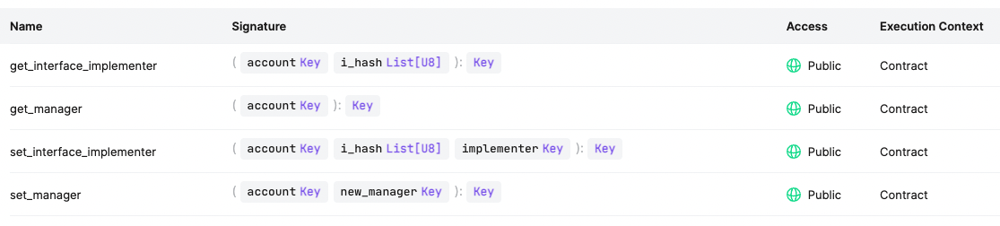

# `CASPER-ERC1820`

A library for developing ERC-1820 registry to notify or revert transfers on the Casper Network.

The main functionality is registering another contract to perform operations on behalf of token owner.
On this way, it offers a safe way to perform operations on the Casper Network.

This contract contains an interface registry for managers and implementers.
What's more, each account can implement more than a single interface.

This library is based on [EIP-1820](https://eips.ethereum.org/EIPS/eip-1820)

On the other hand, you can use this [ERC1820 client script](https://github.com/Rengo-Labs/CasperLabs-ERC777-client/tree/master/src/clients/erc1820)
to interact with the Casper Network.

## Entry points

The actual entry points are:
- *set_interface_implementer* : This entry point is used for registering sender and receiver contracts
- *get_interface_implementer* : This entry point returns the implementer for the caller address. Otherwise, a default account is returned.
- *set_manager* : This entry point is used for registering an account's manager. This manager is able to call ***set_interface_implementer***
- *get_manager* : This entry point returns the account manager, if the manager is the address 0x00, it will return the caller address.

These entry points were not implemented because the ERC165 was not developed.
- *interface_hash* 
- *update_erc165_Cache* 
- *implements_erc165_interface* 
- *implements_erc165_interface_no_cache* 

## ENTRY POINTS ON CASPER NETWORK


## SETTING UP THE PROJECT
To start to develop with this library, you need to follow these steps to avoid errors:

- First, to add target `wasm32-unknown-unknown`.

```bash
make prepare
```

- Second, to build the example ERC-1820 contract, import libs and supporting test contracts:

```bash
make build-contracts
```

- Third, to run test
```bash
make test
```

## DEPLOYMENT
First of all, you must build the **target** package to be able to deploy the contract.

After that, you can deploy putting this command on terminal.

```bash
casper-client put-deploy \
--node-address http://16.162.124.124:7777 \
--chain-name casper-test \
--secret-key ~/TestUser_key.pem \
--session-path ~/casp-777/target/wasm32-unknown-unknown/release/erc1820_registry.wasm \
--payment-amount 50000000000
```