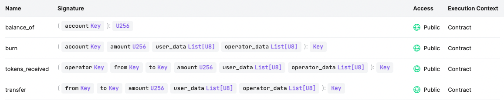
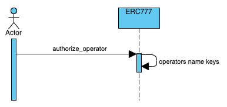

# `CASPER-ERC777-RECIPIENT`

A library for implementing ERC777Recipient and receiving ERC777 token on the Casper network.

This contract allows any contract that extend of this, is capable of receiving tokens. 

This contract lets token's holders know about the tokens are sent to them whenever
they implement this interface. To do this, they must be registered on the ERC1820 registry contract.

Its execution occurs after the token contract's state is updated.
What's more, this contract may revert and prevent the operations from being executed.

On the other hand, you can use this [ERC777 Recipient client script](https://github.com/Rengo-Labs/CasperLabs-ERC777-client/tree/master/src/clients/erc777_recipient)
to interact with the Casper Network.

## ERC777-RECIPIENT'S ENTRY POINT

- **tokens_received** : This entry point is executed by the erc777 when it sends tokens to another account.
- **balance_of** : This entry point could be executed by the contract owner.
- **transfer** : This entry point is used for transfer tokens to other account on behalf of the token owner.
For performing this operation, either you need to register the caller account as an operator, or you must use the token owner.
- **burn** : This entry point is used for burn tokens on behalf of the token owner.
For performing this operation, either you need to register the caller account as an operator, or you must use the token owner.

## ENTRY POINTS ON CASPER NETWORK


## SETTING UP THE PROJECT
To start to develop with this library, you need to follow these steps to avoid errors:

- First, to add target `wasm32-unknown-unknown`.

```bash
make prepare
```

- Second, to build the example ERC-777-RECIPIENT contract, import libs and supporting test contracts:

```bash
make build-contracts
```

- Third, to run test
```bash
make test
```


## DEPLOYMENT
First of all, you must build the **target** package to be able to deploy the contract:

For install this contract you need to deploy the contract using this parameter:
- **erc1820_contract** : This parameter is a type: contract_hash.
- **erc777_contract** : This parameter is a type: contract_hash.

In this example, to deploy an erc777-recipient contract on casper testnet, you need to run this command on terminal:

```bash
casper-client put-deploy \
--node-address http://16.162.124.124:7777 \
--chain-name casper-test \
--session-arg "erc1820_contract:key='contract-KEY_HASH'" \
--session-arg "erc777_contract:key='contract-KEY_HASH'" \
--secret-key ~/Test_key.pem \
--session-path ~/casp-777/target/wasm32-unknown-unknown/release/erc777_recipient.wasm \
--payment-amount 20000000000
```

## REGISTER AN OPERATOR
To use these entry points to transfer or burn tokens, you need to register an operator from 
[ERC-777](../erc777/README.md).



```bash
casper-client put-deploy \
--session-name erc777_token_contract \
--session-entry-point authorize_operator \
--session-arg "operator:Key='account-hash-675e10b7e268c61db84dbc4ddd0dc6c92230b6898e8d2109a3fdc49de8fedab4'" \
--payment-amount 1000000000 \
--chain-name casper-test \
--node-address http://16.162.124.124:7777 \
--secret-key ~/TestUser_key.pem
```