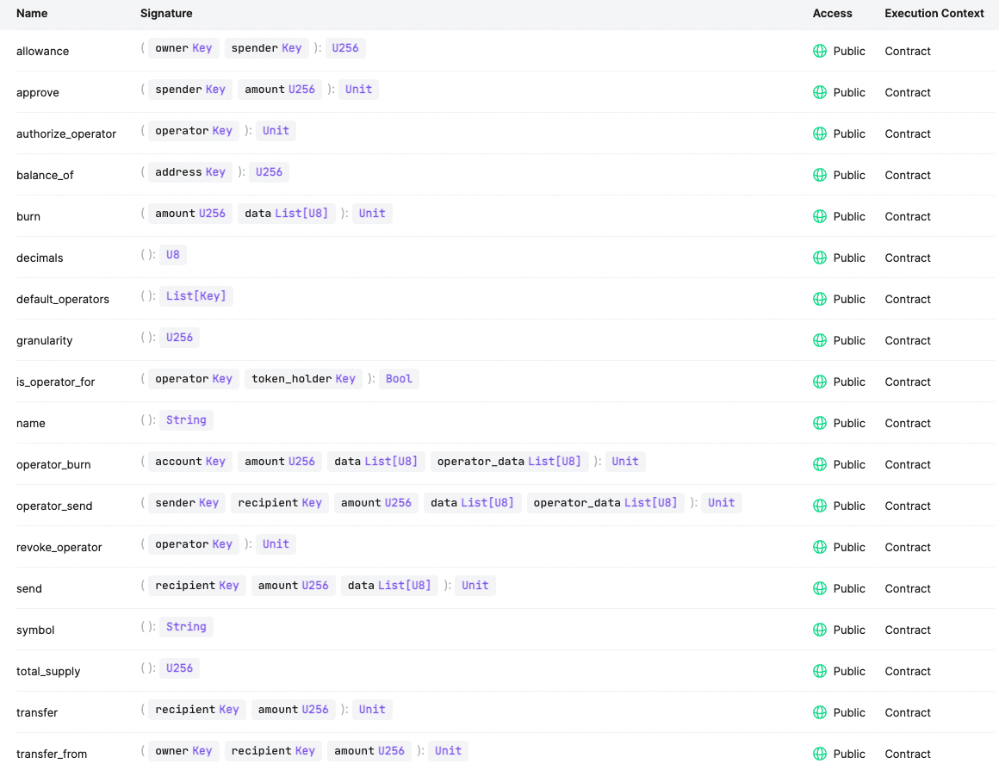

# `CASPER-ERC777`

A library for developing ERC777 tokens for the Casper network.

This contract was modified for working as a ERC777 and is compatible with ERC20.

It implements new entry points for performing sure transfer operations, burn and reception of tokens.
What's more, those tokens can be reverted.

On the other hand, you can use this [ERC777 client script](https://github.com/Rengo-Labs/CasperLabs-ERC777-client/tree/master/src/clients/erc777)
to interact with the Casper Network.

## ERC20'S ENTRY POINT
- **allowance**
- **approve**
- **balance_of**
- **decimals**
- **symbol**
- **total_supply**
- **transfer**
- **transfer_from**

## ERC777'S ENTRY POINT
- **send** : it transfers tokens from a caller's account to another account.
- **operator_send** : it transfers tokens to other account on behalf of token owner and get the 
implementers to notify the tokens sent and received.
- **burn** : it burns tokens of the caller's account.
- **operator_burn** : it burns tokens on behalf of token owner.
- **default_operators** : it returns a list of Addresses for the caller's account.
- **authorize** : it registers an operator to be able to send and burn tokens.
- **revoke** : it removes an operator to avoid performing some operation on behalf of token owner.
- **is_operator_for** : it verifies if the operator is contained in the caller's list.

## ENTRY POINTS ON CASPER NETWORK


## SETTING UP THE PROJECT
To start to develop with this library, you need to follow these steps to avoid errors:

- First, to add target `wasm32-unknown-unknown`.

```bash
make prepare
```

- Second, to build the example ERC-777 contract, import libs and supporting test contracts:

```bash
make build-contracts
```

- Third, to run test
```bash
make test
```

## DEPLOYMENT
First of all, you must build the **target** package to be able to deploy the contract:

For install this contract you need to deploy the contract using this parameter:
- **name**
- **symbol**
- **total_supply**
- **granularity**

In this example, to deploy an erc777 contract on casper testnet, you need to put this command on terminal:
```bash
casper-client put-deploy \
--node-address http://16.162.124.124:7777 \
--chain-name casper-test \
--secret-key ~/Test_key.pem \
--session-arg "name:string='ERC777 Custom'" \
--session-arg "symbol:string='my_erc777'" \
--session-arg "total_supply:u256='100000'" \
--session-arg "granularity:u256='1'" \
--session-path ~/casp-777/target/wasm32-unknown-unknown/release/erc777_token.wasm \
--payment-amount 100000000000
```


**Note**: Before deploying, you need to replace constant ***HASH_ERC1820_REGISTRY*** with the actual **erc1820 contract hash**.
And then uncomment in *external_contract.rs* file these blocks code:

First, uncomment this line from [external_contracts.rs](src/external_contracts.rs):
```rust
//let hash_contract = ContractHash::from_formatted_str(HASH_ERC1820_REGISTRY).unwrap();
```
and then, delete this block code from *set_interface* and *get_interface*
```rust
let hash_contract = storage::dictionary_get(
    registry_uref,
    REGISTRY_CONTRACT_NAME
).unwrap_or_default().unwrap_or_default();
```
Second, you must delete the received Parameter **erc_1820_hash** from **call** 
function from [**erc777-token/erc/main.rs**](../example/implementations/erc777-token/src/main.rs)

```rust
#[no_mangle]
fn call() {
    let name: String = runtime::get_named_arg(NAME_RUNTIME_ARG_NAME);
    let symbol: String = runtime::get_named_arg(SYMBOL_RUNTIME_ARG_NAME);
    let granularity = runtime::get_named_arg(GRANULARITY_RUNTIME_ARG_NAME);
    let total_supply = runtime::get_named_arg(TOTAL_SUPPLY_RUNTIME_ARG_NAME);
    
    //Delete this field and replace for a ContractHash::default()
    let erc1820_hash = runtime::get_named_arg(HASH_ERC1820_RUNTIME_ARG_NAME); 

    let _token = ERC20::install(
        name,
        symbol,
        granularity,
        total_supply,
        erc1820_hash
    ).unwrap_or_revert();
}
```