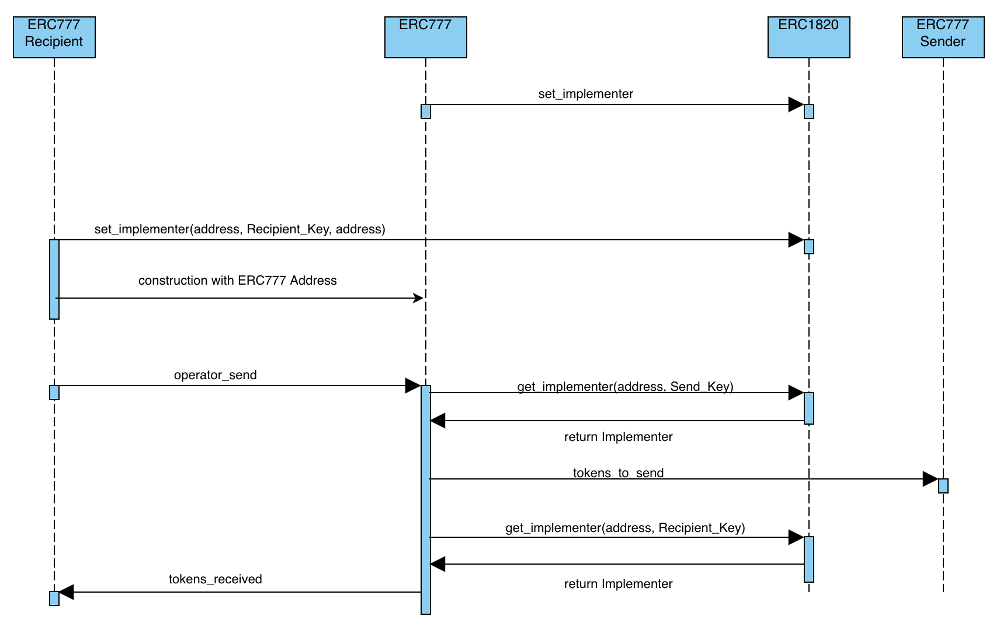

# Casper ERC-777-RECIPIENT

## How it works
### Main Flow
As you can see in the sequence diagram: 
When someone does a transfer to other account, the **operator_send** entry point from erc777 is executed. Then, 
the erc777 gets the implementer if it really exists and executes ***tokens_to_send***'s erc777Sender 
or ***tokens_received***'s erc777recipient. Finally, the ***tokens_received*** is executed retrieving the entry point data.

### Conditions
Firstly, we need to deploy ERC1820 to begin to registry operators. [**ERC-1820**](../../../erc1820/README.md)

Secondly, ERC777 must contain the ERC1820 hash to retrieve the implementers that were registered by the token owner. [**ERC-777**](../../../erc777/README.md)

Thirdly, ERC777Sender must contain the ERC1820 hash and ERC777 hash to registry this contract as implementer and send tokens. [**ERC-777-RECIPIENT**](../../../erc777-recipient/README.md)
