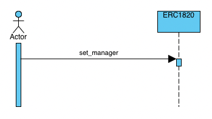

# `CASPER ERC-777-SENDER`

## How it works
### Main Flow
As you can see in the sequence diagram: The [**ERC-777-SENDER**](../../../erc777-sender/README.md) must firstly be registered in the [**ERC-1820**](../../../erc1820/README.md) as an operator to send or burn tokens.
After that, when the [**ERC-777-SENDER**](../../../erc777-sender/README.md) tries to send tokens, this contract does a call to an entry point of transfer or burn tokens from the [**ERC-777**](../../../erc777/README.md). 
And then, internally from the [**ERC-777**](../../../erc777/README.md) is performed a call to retrieve the implementer for the caller's account.

### Conditions
First of all, we need to deploy ERC1820 to begin to registry operators. [**ERC-1820**](../../../erc1820/README.md)

Secondly, ERC777 must add a manager to register an implementer from ERC777 Sender.
After that, the ERC777 Sender must retrieve the implementers that were registered by the token owner. [**ERC-777**](../../../erc777/README.md)

Thirdly, ERC777 Sender must contain the ERC1820 hash and ERC777 hash to registry this contract as implementer and send tokens. [**ERC-777-SENDER**](../../../erc777-sender/README.md)
