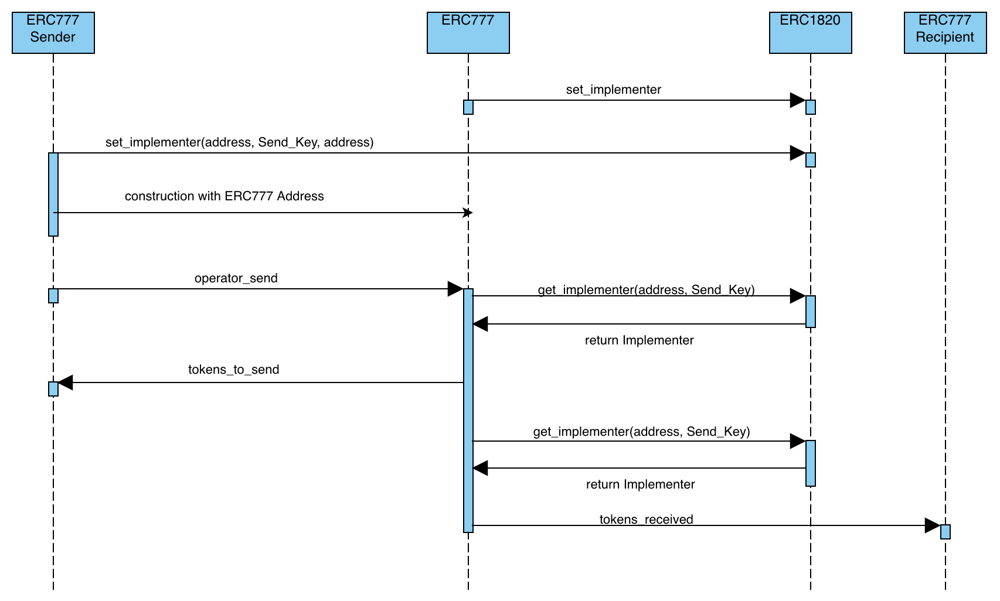

# Casper ERC-777-SENDER

## How it works
### Main Flow
As you can see in the sequence diagram: to use ERC777Sender, the ERC1820 and ERC777 must be deployed and loaded
in the Recipient Contract.

### Conditions
First of all, we need to deploy ERC1820 to begin to registry operators. [**ERC-1820**](../../../erc1820/README.md)

Secondly, ERC777 must contain the ERC1820 hash to retrieve the implementers that were registered by the token owner. [**ERC-777**](../../../erc20/README.md)

Thirdly, ERC777Sender must contain the ERC1820 hash and ERC777 hash to registry this contract as implementer and send tokens. [**ERC-777-SENDER**](../../../erc777-sender/README.md)
